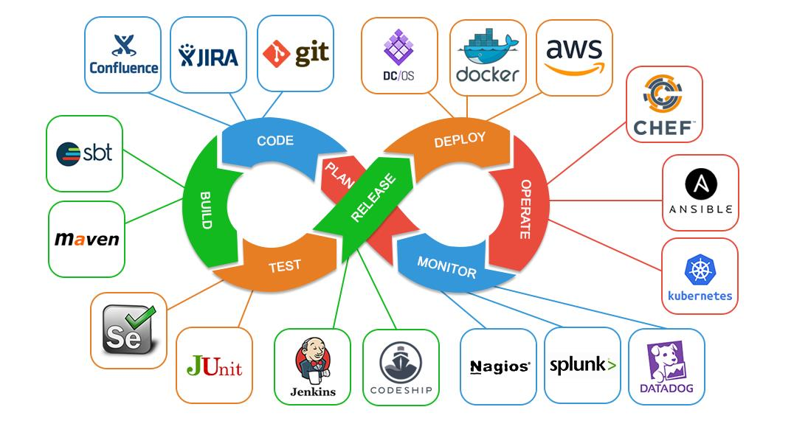

# DOCUMENTACIÓN TÉCNICA SOBRE: DEVOPS

## ÍNDICE

1. [Introducción](indice/introduccion.md)
2. [¿Qué es un administrador de sistemas?](indice/asir.md)
3. [¿Qué es un desarrollador?](indice/desarrollador.md)
4. [¿Qué es Devops?](indice/devops.md)
    1. [Perfil de Devops](indice/perfilDevops.md)

## REFERENCIAS

[Wikipedia](https://es.wikipedia.org/wiki/DevOps)

## LICENCIA

