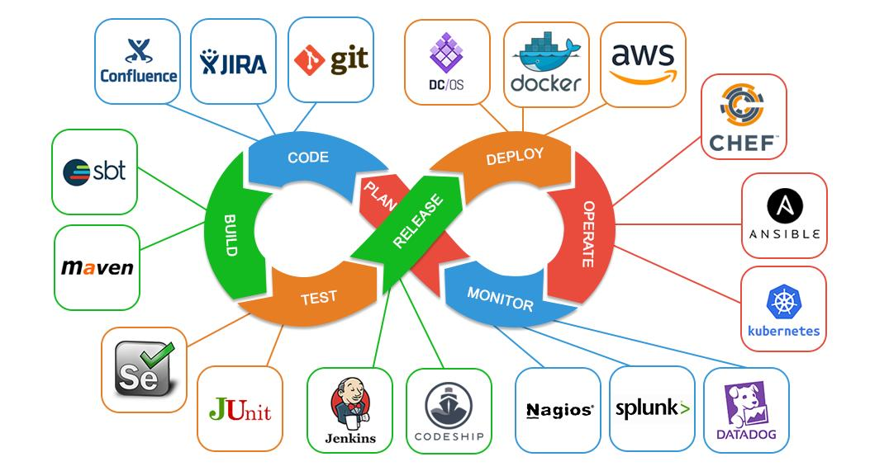

# DOCUMENTACIÓN TÉCNICA SOBRE: DEVOPS

## ÍNDICE

1. [Introducción](introduccion.md)
2. [¿Qué es un administrador de sistemas?](asir.md)
3. [¿Qué es un desarrollador?](desarrollador.md)
4. [¿Qué es Devops?](devops.md)
    1. [Perfil de Devops](perfilDevops.md)

## REFERENCIAS

[Wikipedia](https://es.wikipedia.org/wiki/DevOps)

## LICENCIA

